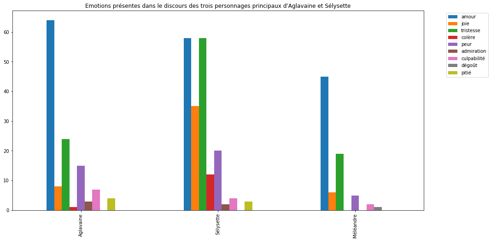
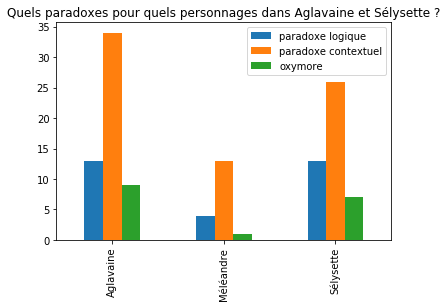
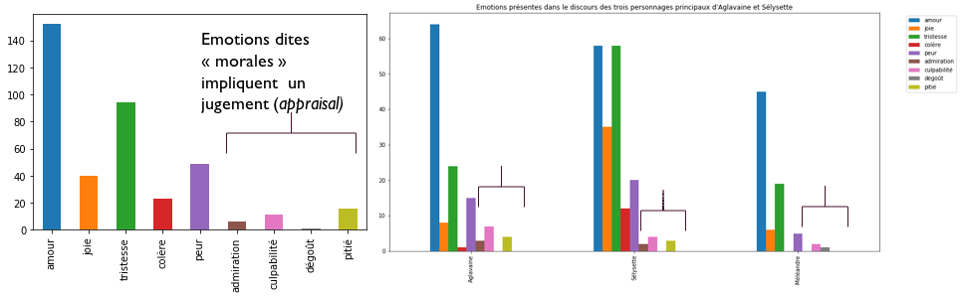

# moraleenaction-data
Visualisation des données utilisées pour l'article sur les moralités multiples de Maeterlinck

page N de l'article:  Un relatif effacement des émotions négatives dans le discours des trois personnages principaux

 On a procédé à un relevé manuel des émotions exprimées dans le discours des personnages. A chaque phrase est assigné un "tag" ou étiquette correspondant à une émotion, directement ou indirectement exprimée, ou à l'absence d'émotion exprimée. Le relevé rassemble ici l'expression dans le discours (expression directe "Je suis triste") et celle, indirecte, qui passe par les tendances à l'action (s'enfuir, embrasser) ou indices moteurs lisibles dans le discours ou les didascalies (pleurer,rire expression indirecte). Des relevés séparés sont disponibles. Ils mettent en évidence l'importance d'assignations impossibles (exclamations, silence) ou ambivalentes , mais aussi l'expression indirecte ou l'évitement: "Je ne suis pas  heureuse", tagé "joie directe" et non tristesse: la tristesse n'est pas énonçable et se dit sur le mode de l'allusion). Ceci n'est pas visualisé ni quantifié dans le présent graphe, où  nous évaluons ce qui, par-delà l'ambiguité généralisée, est exprimé ou tu dans le discours et l'expression corporelle. 
L'ordonnée indique le nombre d'occurences.

page  N  de l'article: Un relevé manuel des figures (oxymore, entendu en un sens élargi; paradoxe logique, paradoxe contextuel) dans le discours des trois personnages principaux. Un tag est assigné à chaque phrase. L'ordonnée indique le nombre d'occurences. Ci-dessous, des exemples d'occurences tirés du texte pour chaque catégorie.

.png)

page N de l'article: graphe sur les verbes présent dans le discours de chaque personnage (à actualiser)

Page N de l'article: l'effacement relatif des émotions morales dans le graphe 1

